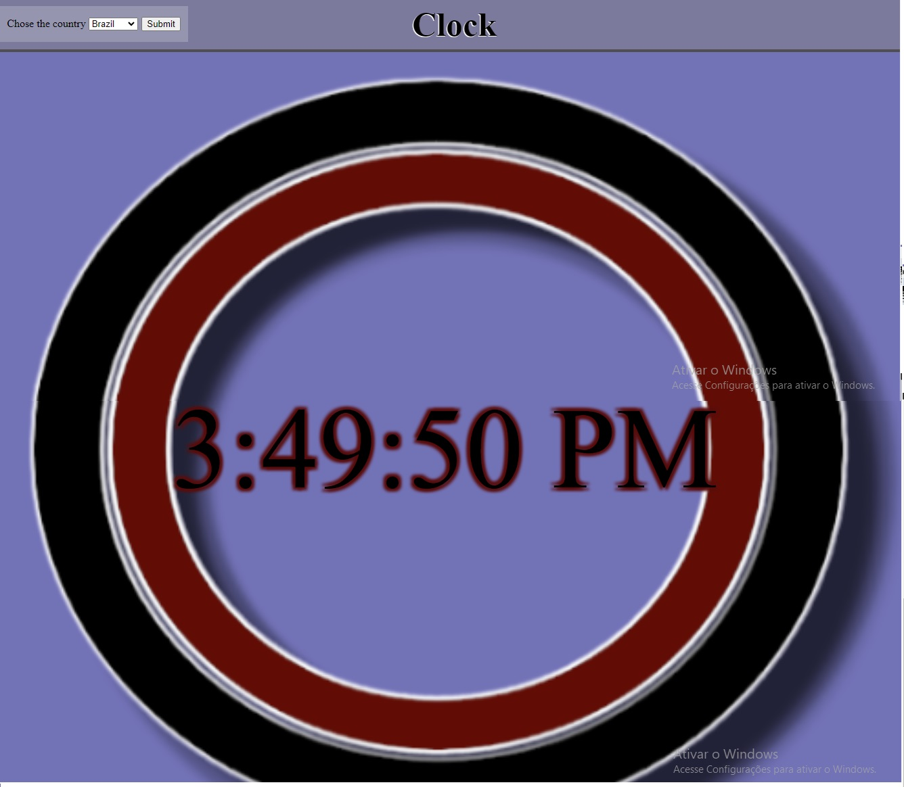
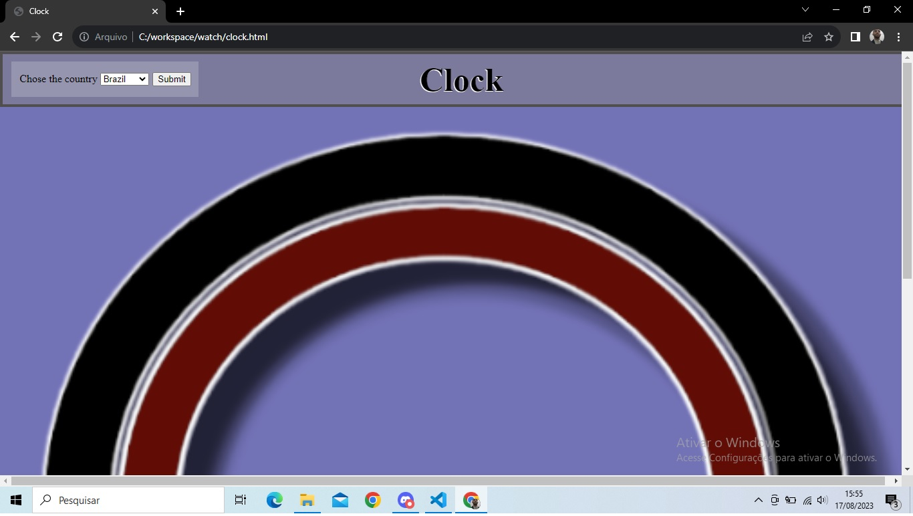

# Global clock

# index

- <a href="#AbautTheProject">About the project</a>
- <a href="#layout"> Layout </a>
- <a href="#tecnologies">Technologies</a>
- <a href="nextSteps">Next Steps</a>
- <a href="AboutTheCreator">About the Creators</a>

## About the project

This project was born from the need to document the basics of JavaScript's Date and Time handling. Its aim is to provide clear insights into time zones, crucial for global time management. By utilizing a comprehensive list of time zones, it creates a universal clock reflecting accurate times across regions. This knowledge is essential for applications catering to a global audience. Through this project, developers gain the tools to handle date, time, and time zones accurately, enhancing their ability to build user-friendly applications with worldwide temporal relevance.

## Layout

## Next Steps

The next crucial phase involves developing a project akin to the current one, this time integrating either an SQL or NoSQL database. This database will serve as the repository for comprehensive time zone details, which will then be accessed by a robust REST API system. This integration empowers the system to efficiently retrieve, manipulate, and transmit time zone information across various applications. By marrying the database's structured or unstructured data storage capabilities with the REST API's standardized communication protocol, a seamless and dynamic interaction emerges, setting the foundation for a powerful and flexible web-based application.

## About the creators

Linkedin Page: <a href="https://www.linkedin.com/in/maur%C3%ADlio-souza-29a14b275/">Maurílio Souza</a>;

GitHub Page: <a href="https://github.com/SouzaSMaurilio">SouzaSMaurilio</a>;